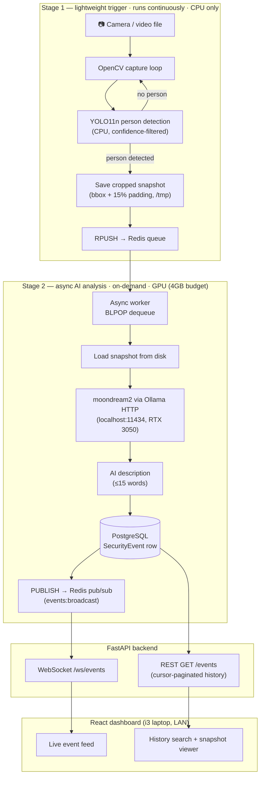

# Surveillance AI — Local, Privacy-First Video Analytics

A self-hosted security camera dashboard that detects people, describes what
they're doing in plain English, and streams alerts to a live dashboard —
**with zero cloud dependency**. Every model, every byte of video, and every
inference call stays on hardware I own.

## Why this project exists

Most "AI camera" products ship your video to someone else's server. This
project asks a narrower, harder question: **how much useful surveillance
intelligence can you get out of consumer hardware you already have,
without sending a single frame off your network?**

The answer shaped every architectural decision below.

## The hardware story

This isn't a cloud GPU cluster — it's a gaming laptop and two hand-me-down
machines on the same LAN.

| Machine | Specs | Role |
|---|---|---|
| Ryzen 5 6600H laptop | RTX 3050, **4GB VRAM** | Backend, AI worker, Ollama, Postgres, Redis |
| i3 7th gen laptop | 12GB RAM, no GPU | React frontend host |
| i5 14th gen desktop | No GPU | Reserve — second capture node candidate |

**4GB of VRAM is the entire budget for AI on this project.** That number
disqualifies almost every "obvious" choice in the vision-language-model
space (13B-parameter LLaVA variants, full-size Gemma, CLIP-large) and
forced a design built around *scarcity* rather than throughput:

- **Two-stage inference, not one.** A single VLM watching a live 24/7
  video feed would either fall over on 4GB or force everything else to
  run on CPU. Instead, a cheap always-on stage (YOLO11n, CPU-only) decides
  *whether anything interesting happened at all*, and only that decision
  wakes up the expensive stage (moondream2, GPU). The VLM only ever looks
  at a handful of snapshots a minute — never a video stream.
- **YOLO11n runs on CPU, on purpose.** The nano variant is cheap enough
  that CPU inference doesn't bottleneck the pipeline, and it means the
  full 4GB VRAM budget is reserved exclusively for the VLM in Stage 2
  instead of being split between two GPU consumers.
- **moondream2 (1.6B params) over anything bigger.** It's small enough to
  live comfortably inside 4GB alongside normal desktop use, and — because
  it's small — it needs architectural help rather than clever prompting:
  frames are cropped to the YOLO bounding box (+15% padding, with a
  minimum crop size) *before* they ever reach the VLM. Asking a model
  this size to "ignore the background" in a prompt doesn't work reliably;
  removing the background from the pixels it sees does.
- **The frontend doesn't run on the GPU machine.** The dashboard is just
  a React app talking to a WebSocket — no reason to make the RTX laptop
  do double duty as a dev box when a spare laptop with Node already
  installed can host it over the LAN instead.
- **The third machine is a placeholder, not an afterthought.** The i5
  desktop is documented as a reserve capture node for a future second
  camera, but nothing today is architected around it — adding hardware
  later should be additive, not a rewrite.

Every constraint above is still true at time of writing. The honest
limitation of this project is the 4GB ceiling itself: it's the reason
moondream2 was chosen over a more capable VLM, and the clearest path to a
noticeably smarter system is simply better hardware — not better code.

## Architecture (two-stage pipeline)

The split exists because of the 4GB VRAM ceiling above: Stage 1 runs
continuously and never touches the GPU, so the entire VRAM budget stays
free for Stage 2, which only wakes up when there's actually something to
analyze.

**Reading the diagram:**
- **Stage 1 never blocks on Stage 2.** A busy or restarting Ollama process
  can't stall the capture loop — the queue absorbs the gap.
- **The dashboard never receives raw video.** Only structured events
  (description + snapshot filename + confidence) cross the WebSocket —
  matching the "no raw video stream in browser" rule for this project.
- **Two independent OS processes**, not two threads in one app — the
  capture/detection loop and the AI worker can be restarted, scaled, or
  moved to a different machine independently.

## Stack

- **Capture / detection:** OpenCV, YOLO11n (ultralytics), CPU-only
- **AI analysis:** moondream2 via Ollama HTTP API — never loaded directly
  in Python, always over `localhost:11434`
- **Backend:** FastAPI, SQLAlchemy 2.0 (async), Alembic, PostgreSQL,
  Redis (queue + pub/sub)
- **Frontend:** React + TypeScript + Vite + Tailwind v4
- **Infra:** Docker Compose (Postgres + Redis only) — no Kubernetes, no
  cloud, ever

## Status

Currently in Week 6 (optimisation, docs, GitHub polish). Weeks 1–5
(infrastructure → detection pipeline → AI worker → REST/WebSocket API →
React dashboard) are complete. Setup instructions and the multi-node
write-up land in follow-up tasks this week (W6T5, W6T6).
